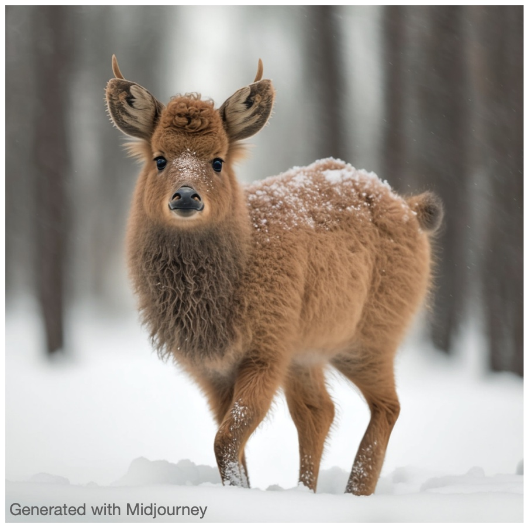
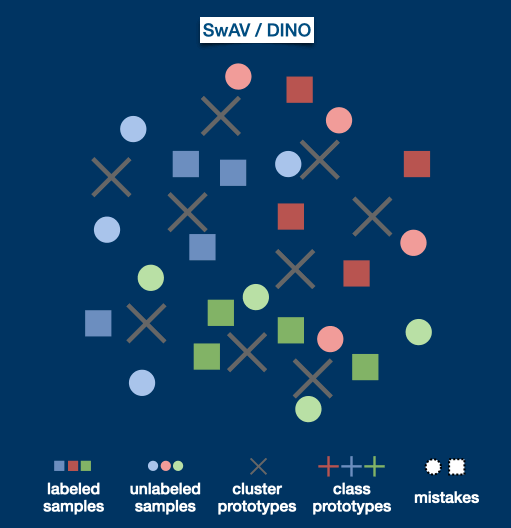
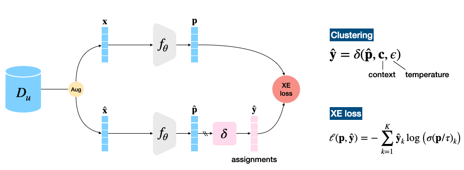

# [Semi-supervised learning made simple with self-supervised clustering [CVPR 2023]](https://openaccess.thecvf.com/content/CVPR2023/html/Fini_Semi-Supervised_Learning_Made_Simple_With_Self-Supervised_Clustering_CVPR_2023_paper.html)
[Enrico Fini](https://scholar.google.com/citations?user=OQMtSKIAAAAJ&hl=en), [Pietro Astolfi](https://scholar.google.com/citations?user=4zR244YAAAAJ&hl=en&oi=ao), [Karteek Alahari](https://scholar.google.com/citations?user=qcyG7rwAAAAJ&hl=en&oi=ao), [Xavier Alameda-Pineda](https://scholar.google.com/citations?user=ukI2bz8AAAAJ&hl=en&oi=ao), [Julien Mairal](https://scholar.google.com/citations?user=Bx9WGD6lBFEC&hl=en&oi=ao), [Moin Nabi](https://scholar.google.com/citations?user=31seHAMAAAAJ&hl=en&oi=ao), [Elisa Ricci](https://scholar.google.com/citations?user=xf1T870AAAAJ&hl=en&oi=ao)

This repository extends the self-supervised clustering methods, SwAV and DINO, to the semi-supervised setting via simple multi-tasking with supervised learning, obtaining Suave ☁ and Daino 🦌 (fallow deer in Italian).

<div align="center">
 
</div>

## Abstract
*Self-supervised learning models have been shown to learn rich visual representations without requiring human annotations. However, in many real-world scenarios, labels are partially available, motivating a recent line of work on semi-supervised methods inspired by self-supervised principles. In this paper, we propose a conceptually simple yet empirically powerful approach to turn clustering-based self-supervised methods such as SwAV or DINO into semi-supervised learners. More precisely, we introduce a multi-task framework merging a supervised objective using ground-truth labels and a self-supervised objective relying on clustering assignments with a single cross-entropy loss. This approach may be interpreted as imposing the cluster centroids to be class prototypes. Despite its simplicity, we provide empirical evidence that our approach is highly effective and achieves state-of-the-art performance on CIFAR100 and ImageNet.*

## Architecture


# Training on ImageNet

## Requirements
Our **conda** environment is reported in [`suavedaino_env.yml`](suavedaino_env.yml) and can be installed with: `conda env create -f suavedaino_env.yml`

Otherwise the main requirements are:
- Python 3.8
- Pytorch 1.11.0
- Torchvision 0.12
- CUDA 11.3
- Other dependencies: scipy, pandas, numpy, wandb

## Semi-sup pre-training
Suave or Daino semi-supervised pre-training and finetuning can be both launched using [`job_launcher.py`](job_launcher.py). This script set all the environment arguments needed, e.g., # gpus, and eventually launches either [`main_suave.py`](`suave/main_suave.py) or [`main_daino.py`](`suave/main_daino.py).

### Multinode training
Distributed training is available via Slurm. It can be enabled by setting `--mode slurm`.

### Reproducing our experiments 
The pre-training on ImageNet can be reproduced using the scripts stored in [suave/scripts](suave/scripts/) and[daino/scripts](daino/scripts/) and downloading the self-sup [SwAV checkpoint](https://dl.fbaipublicfiles.com/deepcluster/swav_800ep_pretrain.pth.tar) and [DINO checkpoint](https://dl.fbaipublicfiles.com/dino/dino_deitsmall16_pretrain/dino_deitsmall16_pretrain_full_checkpoint.pth).

To reproduce Suave results on a single node with 8 gpus in the semi-supervised setting with 10% of the ImageNet labels available; the training can be launched as:

```
python job_launcher.py  \
    --mode local \
    --num_gpus 8 \
    --method suave \
    --script_file suave/scripts/train_10perc.sh \
    --data_dir /path/to/imagenet \
    --name repro_suave_imagenet_10perc \
```

To reproduce Daino results instead, we suggest to use 2 nodes with 8 gpus each to ensure a total batch size comprising 512 labelled and 1024 unlabelled samples, respectively (we have not tested smaller batch sizes).

```
python job_launcher.py  \
    --mode slurm \
    --num_nodes 2 \
    --num_gpus 8 \
    --method daino \
    --script_file daino/scripts/train_10perc.sh \
    --data_dir /path/to/imagenet \
    --name repro_daino_imagenet_10perc \
```

## Semi-sup finetuning
For the fine-tuning simply substitute `train_10perc.sh` with `finetune_10perc.sh`, provide a meaningful exp name (`--name`), and, inside the finetune script, substitute `/path/to/ckpt.pth` with the actual checkpoint path to be finetuned.


## Additional comments on daino 
* The code does not fully implement the mixup on unlabeled images. Hence, we excluded it from our recipe. 
* We do not provide a recipe for finetuning Daino, as we have not explored it. However, fine-tuning can be still be launched/investigated following the steps mentioned above. 


## License
See the [LICENSE](LICENSE) file for more details.

## Ackowledgements
This repository is based on the official [SwAV](https://github.com/facebookresearch/swav) and [DINO](https://github.com/facebookresearch/dino) repos by Caron *et al.*. We greatly commend the Authors of these repos for sharing them with the community.  

## Citation
```
@inproceedings{fini2023semi,
  title={Semi-supervised learning made simple with self-supervised clustering},
  author={Fini, Enrico and Astolfi, Pietro and Alahari, Karteek and Alameda-Pineda, Xavier and Mairal, Julien and Nabi, Moin and Ricci, Elisa},
  booktitle={Proceedings of the IEEE/CVF Conference on Computer Vision and Pattern Recognition},
  pages={3187--3197},
  year={2023}
}
```
